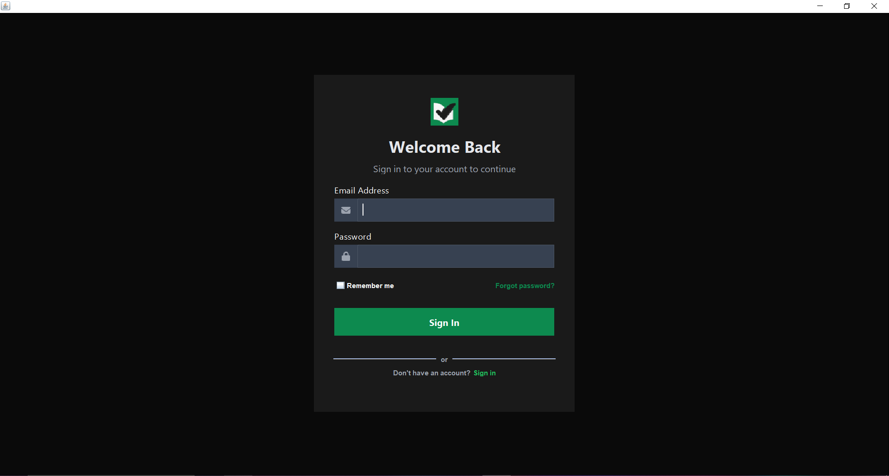
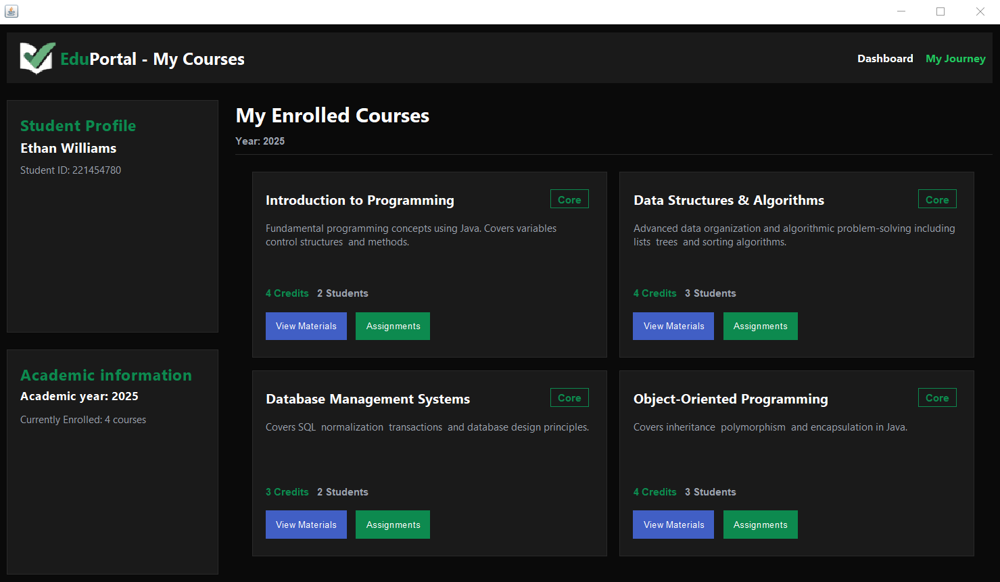
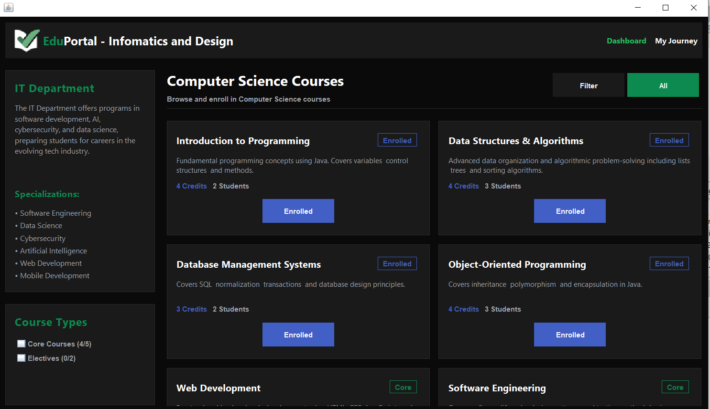
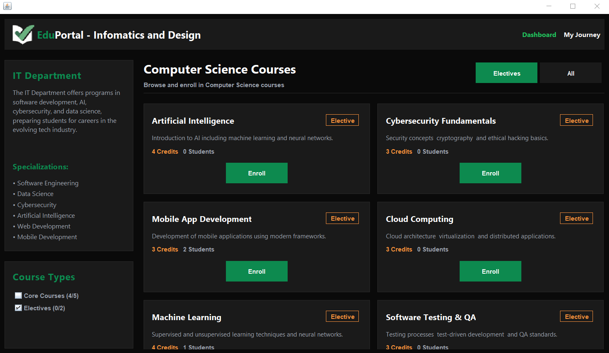
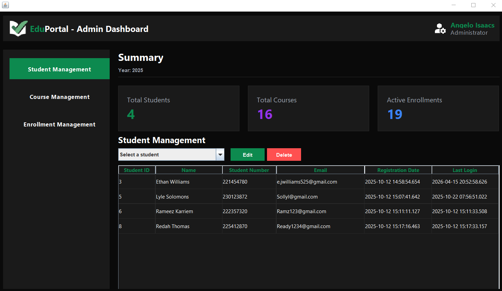
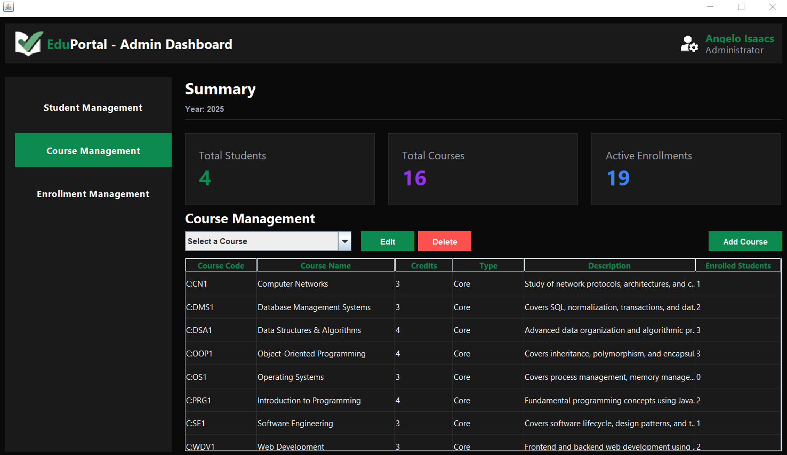
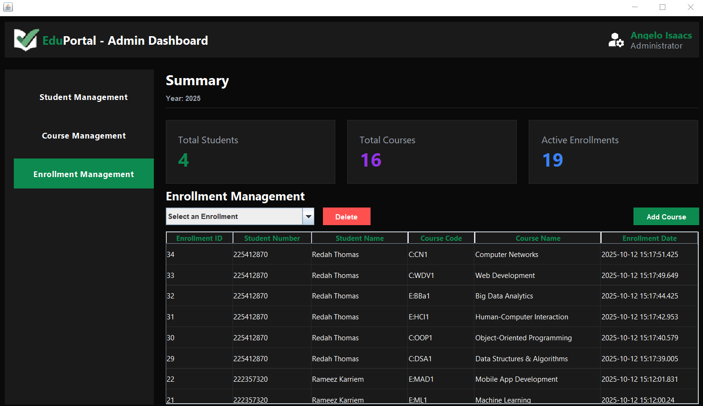
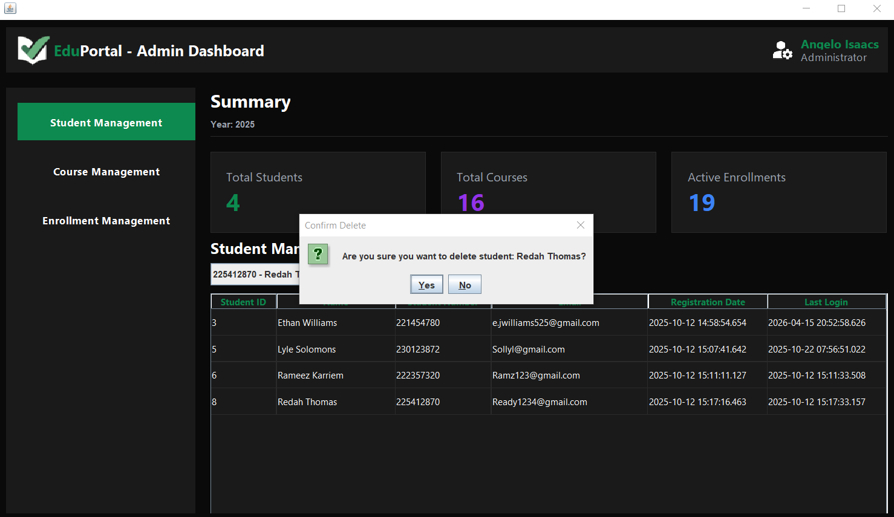
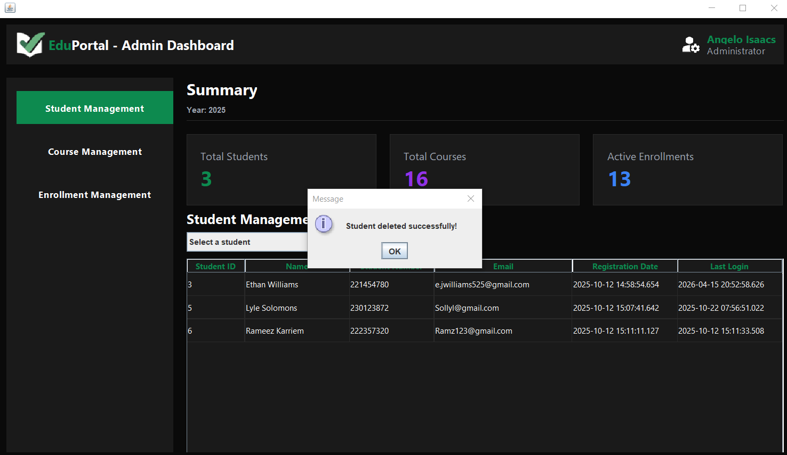

# Student Management System

## Description
This is a Java-based desktop Student Management System developed as part of a group project. The system allows users to manage student records efficiently through a graphical user interface.

The application was built using Java Swing for the front-end and SQL for backend data storage and management.

This project demonstrates my understanding of object-oriented programming, GUI design, and database integration.

## Features
- Add new student records
- Update existing student information
- Delete student records
- View and search student data
- User-friendly graphical interface

## Technologies Used
- Java (Swing)
- SQL (Database)
- JDBC (Database connectivity)

## My Role
- Developed parts of the user interface using Java Swing
- Assisted with database integration
- Collaborated with team members on system design and functionality

## Screenshots

### 🔐 Login UI

### 🖥️ Main Interface

### 📚 Courses Available

### 🎓 Electives Offered

### 👨‍🎓 Student Management

### 📖 Course Management

### 📝 Enrollment Management

### ❌ Student Removal

### ⚠️ Student Removal Confirmation

## Project Link
🔗 https://github.com/EthanWilliams02/Term4_ADP_Assignment
