# NSFAS Application Redesign

## Description  
This project is a redesigned version of the NSFAS (National Student Financial Aid Scheme) application interface aimed at improving usability, accessibility, and overall user experience for students applying for financial aid. The redesign focuses on simplifying the application process, improving navigation flow, and making the interface more visually clear and user-friendly.

The goal of this project was to reduce confusion during the application process by applying modern UI/UX design principles such as clear hierarchy, consistent layout, and step-by-step user guidance.

## Features  
- Simplified and user-friendly application flow  
- Improved form layout and readability  
- Clear step-by-step application structure  
- Better visual hierarchy and spacing  
- More intuitive navigation between sections  
- Mobile-friendly and responsive design approach  
- Reduced cognitive load for users during application  

## Technologies Used  
- Figma (UI/UX Design & Prototyping)  
- Wireframing & High-Fidelity Mockups  
- User-Centered Design Principles  
- UX Flow Mapping Techniques  

## My Role  
- Redesigned the NSFAS application interface in Figma  
- Created improved user flows and wireframes  
- Designed high-fidelity UI screens for better usability  
- Focused on improving accessibility and user experience  
- Ensured consistency across all redesigned screens  

## 📸 Screenshots

---

### 🔐 Authentication
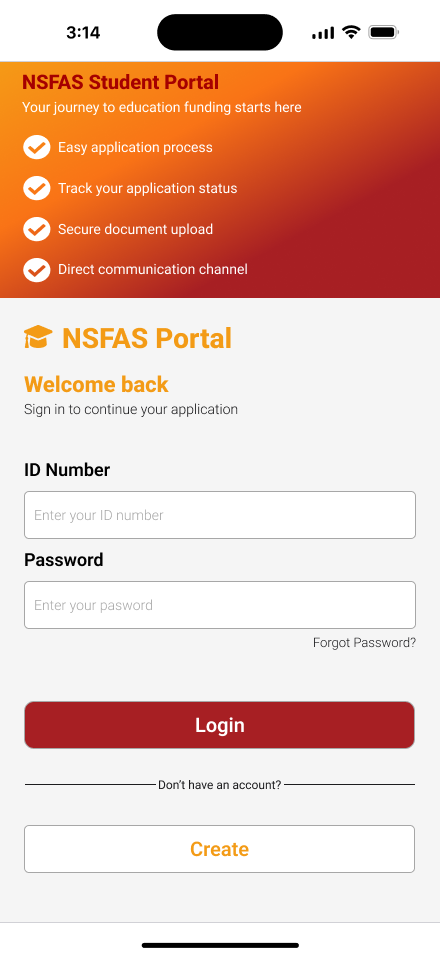  
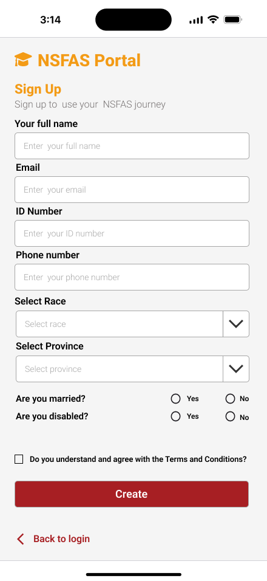  
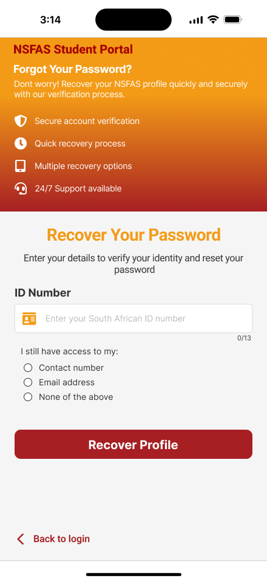

---

### 🏠 Dashboard
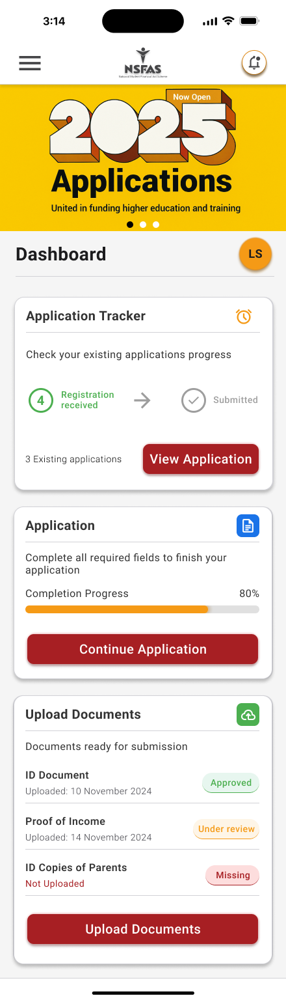

---

### 📄 Applications
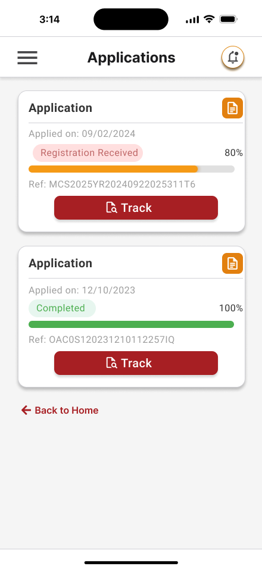  
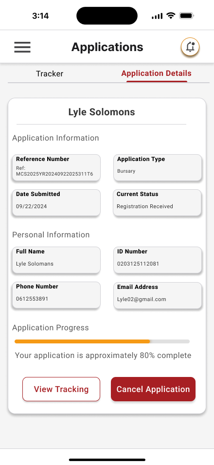

---

### 🔔 Notifications
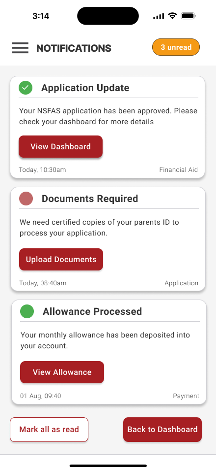

---

### 👤 User Profile
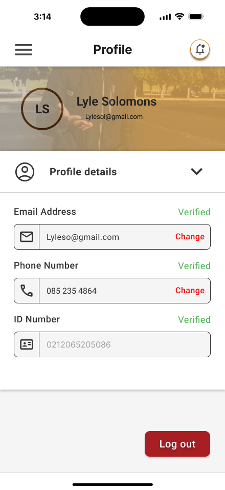

---

### 📊 Tracking
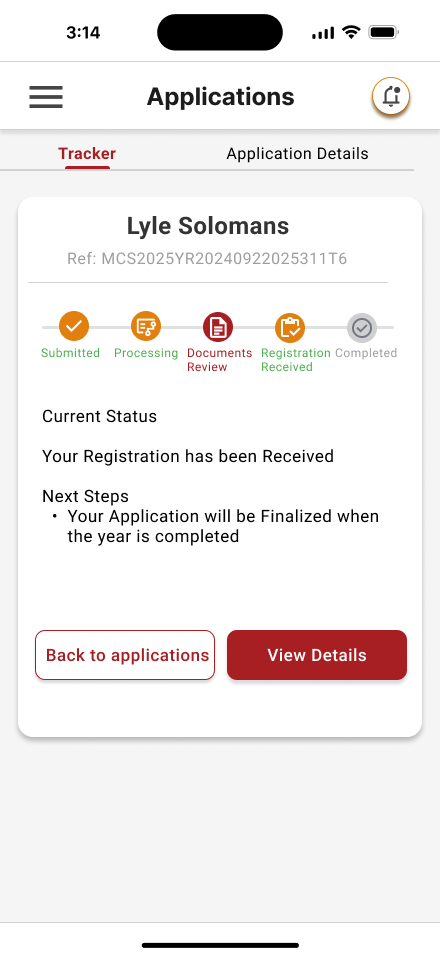

---

### 💰 Allowance
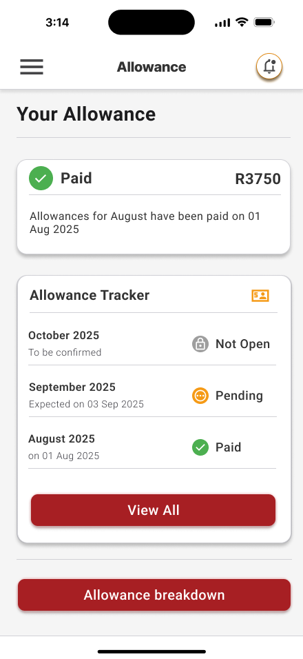  
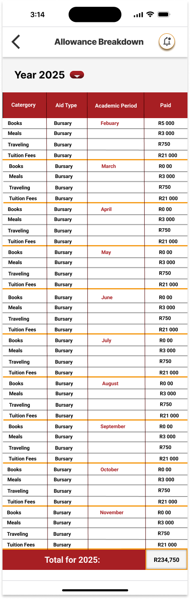

## Project Link  
https://www.figma.com/design/2o459QPq1FgqfB1zrhvukq/Untitled?node-id=0-1&t=PdhaN8HvxxhJSJt2-1
